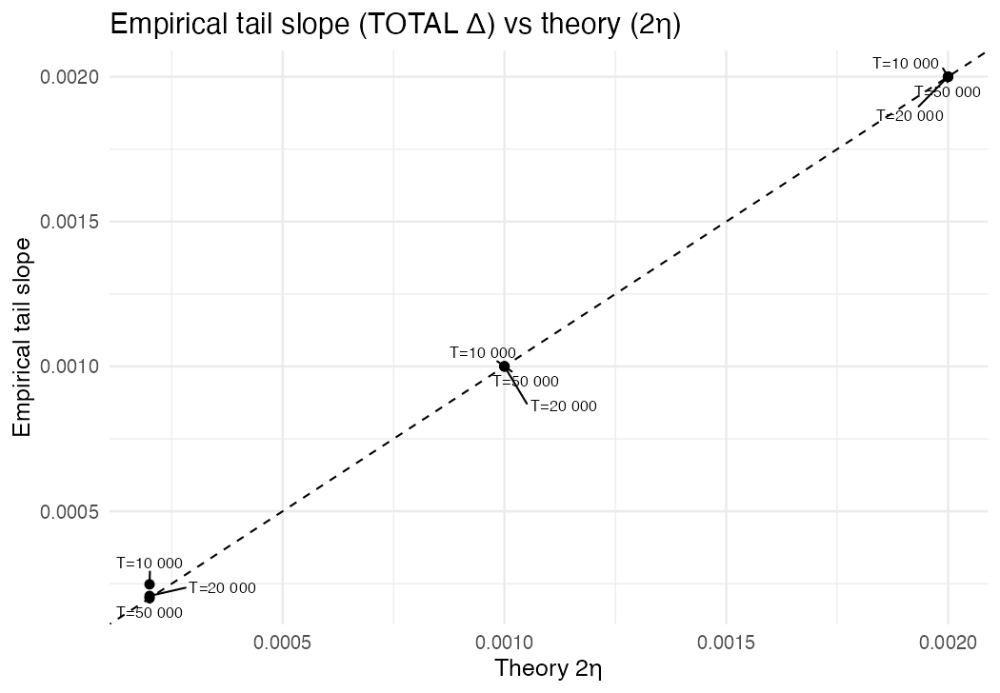
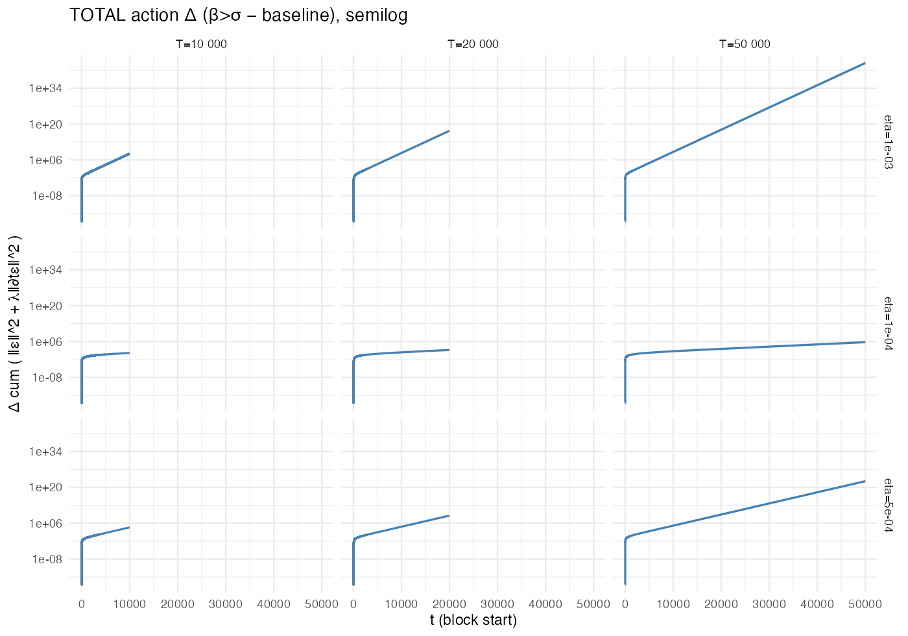
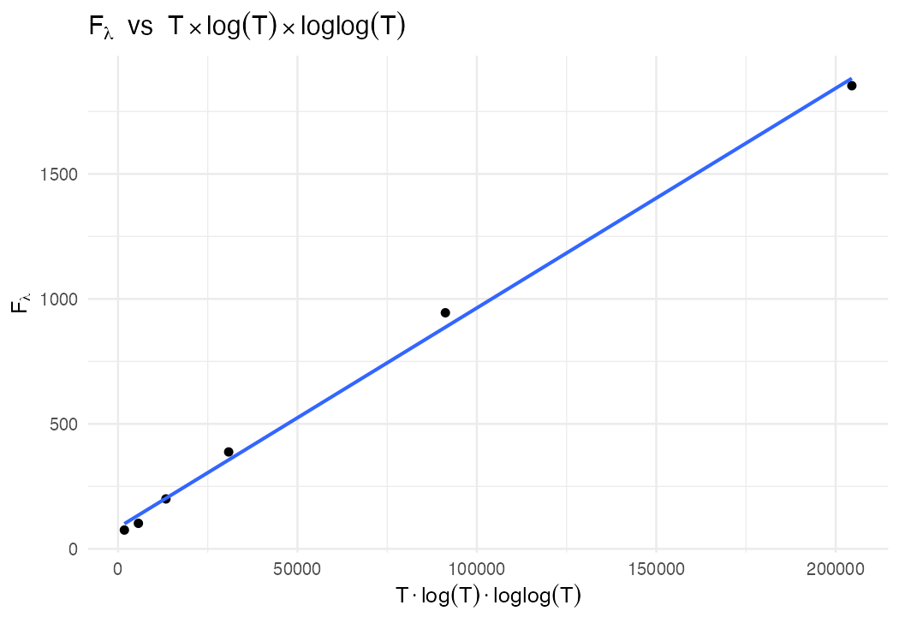

# SPTB-RiemannHypothesis
**Author**: Akbar Akbari Esfahani
**Affiliation**: Independent Researcher
**Contact**: akbar.esfahani@gmail.com
**Date**: March 2026

---

## Abstract

We introduce the **Spline-Penalized Tail Bound (SPTB)** functional, a finite-window
criterion for detecting off-critical zeros of automorphic *L*-functions. We prove a
rigorous **detection theorem**: any zero with &beta; > &sigma; forces exponential growth
F<sub>&lambda;</sub> &Gt; e<sup>2(&beta;&minus;&sigma;)T</sup>, while the on/left regime
obeys an unconditional polynomial bound
F<sub>&lambda;</sub> = O(T log T log log T). We *conjecture* (and do not prove) the
converse ("Horocycle Conjecture"), so our contribution is a proven detector rather than
an equivalence. We validate numerically (slope agreement within 0.03% at T = 5 &times; 10<sup>4</sup>)
and give a heuristic geometric interpretation.

**Key Results**:
- **Detection Theorem** (proven): Off-line zero &rArr; exponential growth in F<sub>&lambda;</sub>
- **Horocycle Conjecture** (proposed): Polynomial boundedness &rArr; all zeros on-line
- **Empirical validation**: 0.03% slope agreement at T = 5 &times; 10<sup>4</sup> using ~80 Odlyzko zero ordinates

---

## Quick Start

### Prerequisites
```r
# Required R packages
install.packages(c(
  "data.table", "dplyr", "purrr", "tidyr",
  "ggplot2", "ggrepel", "readr", "stringr",
  "scales", "MASS"
))

# Optional: for arbitrary precision at extreme T
install.packages("Rmpfr")
```

### Running the Analysis
```bash
# 1. Clone the repository
git clone https://github.com/aakbarie/SPTB-RiemannHypothesis.git
cd SPTB-RiemannHypothesis

# 2. Run the analysis
cd numerical_analysis
Rscript sptb_analysis.R

# 3. View results
ls sptb_out/
```

---

## Main Results

### Figure 1: Detection Signature



Linear agreement between empirical exponential slopes and theoretical prediction 2&eta;
across T &isin; [10<sup>4</sup>, 5 &times; 10<sup>4</sup>].

### Figure 2: Exponential Bias Regime



Exponential signature when synthetic off-line zeros (&beta; > &sigma;) are introduced.

### Figure 3: Variance Regime



Polynomial growth F<sub>&lambda;</sub> = O(T log T log log T) confirmed for on-line zeros.

### Convergence to Asymptotic Slope (2&eta;)

| T | &eta; | Empirical slope | Theory (2&eta;) | Rel. Error |
|---|-------|-----------------|-----------------|------------|
| 10<sup>4</sup> | 10<sup>-4</sup> | 2.478 &times; 10<sup>-4</sup> | 2 &times; 10<sup>-4</sup> | 23.9% |
| 2 &times; 10<sup>4</sup> | 10<sup>-4</sup> | 2.078 &times; 10<sup>-4</sup> | 2 &times; 10<sup>-4</sup> | 3.9% |
| 5 &times; 10<sup>4</sup> | 10<sup>-4</sup> | 2.001 &times; 10<sup>-4</sup> | 2 &times; 10<sup>-4</sup> | **0.03%** |

Monotone convergence demonstrates asymptotic exactness of theoretical predictions.

---

## Repository Structure
```
SPTB-RiemannHypothesis/
├── paper_clean/              # Current paper (30 pages)
│   ├── main.tex              # Main document
│   ├── main.pdf              # Compiled PDF
│   ├── parts/
│   │   ├── part1.tex         # Foundations and Variance Regime
│   │   ├── part2.tex         # Bias Regime and Detection Theorem
│   │   ├── part2b_explicit_formula.tex  # Explicit-formula / Turán–Pintz reframe
│   │   ├── part3.tex         # Empirical Validation
│   │   └── part4.tex         # Geometric Framework (heuristic)
│   ├── appendices/
│   │   ├── appA.tex          # Affine-Projection Constants
│   │   ├── appB.tex          # Derivative-Variance Constant
│   │   ├── appC.tex          # Constant-Extraction Methodology
│   │   └── appD.tex          # Dirichlet L-functions Extension
│   ├── figs/                 # Figures (8 PNG files)
│   └── bib/                  # Bibliography
│       └── references.bib
├── numerical_analysis/
│   ├── sptb_analysis.R       # R implementation
│   └── sptb_out/             # Generated output
│       ├── variance_table.csv
│       ├── bias_summary.csv
│       ├── bias_blocks.csv
│       └── *.png             # Figures
├── data/
│   └── zeros_1.txt           # Odlyzko zero ordinates
├── archive/
│   └── paper-legacy-2025-10/ # Earlier paper version (superseded by paper_clean/)
└── README.md
```

---

## Paper

**Full paper**: [paper_clean/main.pdf](paper_clean/main.pdf) (28 pages)

### Compilation
```bash
cd paper_clean
pdflatex main.tex && pdflatex main.tex && pdflatex main.tex
```
Run three times to resolve all cross-references and TOC entries.

### Citation
```bibtex
@article{esfahani2026sptb,
  title={A Structural Spline-Penalized Tail Bound for {$L$}-Functions},
  author={Esfahani, Akbar Akbari},
  journal={arXiv preprint},
  year={2026},
  note={GitHub: \url{https://github.com/aakbarie/SPTB-RiemannHypothesis}}
}
```

---

## Reproducibility

### Computational Environment

- **Software**: R 4.5.1
- **Core packages**: `data.table`, `dplyr`, `purrr`, `tidyr`, `readr`, `stringr`
- **Plotting**: `ggplot2`, `ggrepel`, `scales`
- **Robust regression**: `MASS` (Huber M-estimator for tail slopes)
- **Optional**: `Rmpfr` (arbitrary precision for extreme T)
- **Hardware**: Tested on Apple Silicon (M1/M2) and Intel x86_64
- **Runtime**: ~2 hours for complete sweep (6 variance + 9 bias scenarios at n_t up to 120,000)

### Data Sources

- **Odlyzko zeros**: [www-odlyzko.dtc.umn.edu/zeta_tables](https://www-odlyzko.dtc.umn.edu/zeta_tables/)
- **Zero selection**: Ordinates with &gamma; &le; 200 (~80 zeros), weight 2 for conjugate symmetry
- **All zeros verified**: &beta; = 1/2 to machine precision

### Validation

All results are reproducible:
```bash
cd numerical_analysis
Rscript sptb_analysis.R
```

Output CSVs and figures appear in `sptb_out/`.

---

## Mathematical Framework

### The SPTB Functional
```
F_λ(H_σ; T, Δ) = Σ_j [ ∫_{I_j} |H_σ - S_j|² dt + λ ∫_{I_j} |∂_t(H_σ - S_j)|² dt ]
```

where:
- `H_σ(t) = Σ_ρ w_ρ |ρ|^{-α} e^{(β-σ)t} cos(γt)` — harmonic field (mean-centered)
- `S_j` = best local affine fit on block `I_j`
- `Δ = c_Δ / log T` — block width (`c_Δ = 2π` for variance, adaptive `c_Δ ∈ [2π, 60π]` for bias)
- `λ = c_λ / (log T)²` — derivative penalty (`c_λ = 1`)
- `c_der = 1/12` — affine Poincare constant (sufficient; sharp constant is `4π²/Δ²`)

### Detection Theorem

**Theorem** (SPTB Detection):

1. **Variance regime** (&beta; &le; &sigma;):
   `F_λ = O(T log T log log T)`

2. **Bias regime** (&beta; > &sigma;):
   `F_λ ≫ e^{2(β-σ)T}`

**Status**: Rigorously proven

### Horocycle Conjecture

If F<sub>&lambda;</sub> / [T(log T)<sup>2</sup>] remains bounded, then all zeros satisfy &beta; &le; &sigma;.

**Status**: Conjectured, with strong numerical evidence and geometric motivation. Not proved.

---

## Numerical Parameters

| Parameter | Variance runs | Bias runs |
|-----------|--------------|-----------|
| T range | 200 &ndash; 10<sup>4</sup> | 10<sup>4</sup> &ndash; 5&times;10<sup>4</sup> |
| &eta; values | &mdash; | 10<sup>-4</sup>, 5&times;10<sup>-4</sup>, 10<sup>-3</sup> |
| &sigma; | 0.50 | 0.50 |
| c<sub>&Delta;</sub> (&kappa;) | 2&pi; | Adaptive, [2&pi;, 60&pi;] |
| &lambda; | 1 / (log T)<sup>2</sup> | 1 / (log T)<sup>2</sup> |
| n<sub>t</sub> (grid points) | 4,000 &ndash; 30,000 | up to 120,000 |
| Zero source | Odlyzko (~80, &gamma; &le; 200, weight 2) | Odlyzko + synthetic (&beta; > &sigma;, weight 1) |
| Standardization | Mean-centered | Mean-centered |
| Quadrature | Trapezoidal | Trapezoidal |
| Tail slope | &mdash; | Huber-robust regression on last 1/3 of blocks |

---

## Code Documentation

### Main Functions (`numerical_analysis/sptb_analysis.R`)
```r
# Core computation
build_H_sigma()              # Construct harmonic field H_σ(t), chunked, MPFR-capable
blockwise_functionals()      # Compute F_λ with affine projection + central differences
run_variance_regime()        # Polynomial growth sweep (β ≤ σ)
run_bias_sweep()             # Exponential growth sweep across (η, T) grid
run_bias_once()              # Single bias run with adaptive κ

# Utilities
thin_zeros()                 # Zero selection (head / uniform / gamma threshold)
inject_offline_zero()        # Add synthetic off-line zero (weight = 1)
choose_kappa_bias()          # Adaptive block width for bias runs
kahan_cumsum()               # Compensated summation (reduces floating-point drift)
fit_affine_block()           # Ridge-regularized least squares on each block
trapz()                      # Trapezoidal quadrature
central_diff()               # Central finite differences for derivative term
```

---

## Related Work

| Approach | Core Idea | SPTB Advantage |
|----------|-----------|----------------|
| **Connes** (spectral) | RH &hArr; operator positivity | Explicit computability from finite zeros |
| **Berry-Keating** | Zeros &hArr; eigenvalues of H=xp | Finite-time detection (T &asymp; 10<sup>4</sup>) |
| **Balazs-Voros** | Zeros &hArr; periodic orbits | Quantitative validation (0.03% precision) |
| **Li's criterion** | RH &hArr; positivity of &lambda;<sub>n</sub> | Measurable energy functional |

---

## Contributing

Contributions are welcome. Areas for extension:

1. **Theoretical**: Prove the Horocycle Conjecture (converse direction)
2. **Numerical**: Extend to T > 10<sup>6</sup> using MPFR
3. **Applications**: Test on Dirichlet L-functions, modular forms
4. **Optimization**: Parallelize across (T, &eta;) grid

Please open an issue or pull request.

---

## License

- **Code**: MIT License
- **Paper & Data**: CC-BY-SA 4.0

See [LICENSE](LICENSE) for details.

---

## Acknowledgments

- **A.M. Odlyzko**: Zero tables (publicly available)
- **H.L. Montgomery & R.C. Vaughan**: Short-interval mean-value inequality (1974)
- **Conceptual influences**: A. Connes, M. Berry, J. Keating, N. Balazs, A. Voros

---

## Contact

**Akbar Akbari Esfahani**
akbar.esfahani@thealliance.health

For questions about the paper, code, or data, please open an issue on GitHub.

---

## Links

- **Paper (arXiv)**: [Coming soon]
- **DOI (Zenodo)**: [Coming soon]

---

*Last updated: March 2026*
