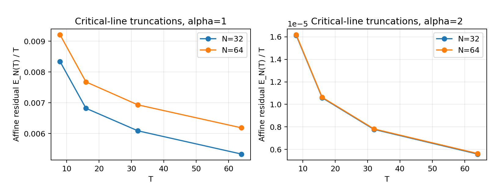
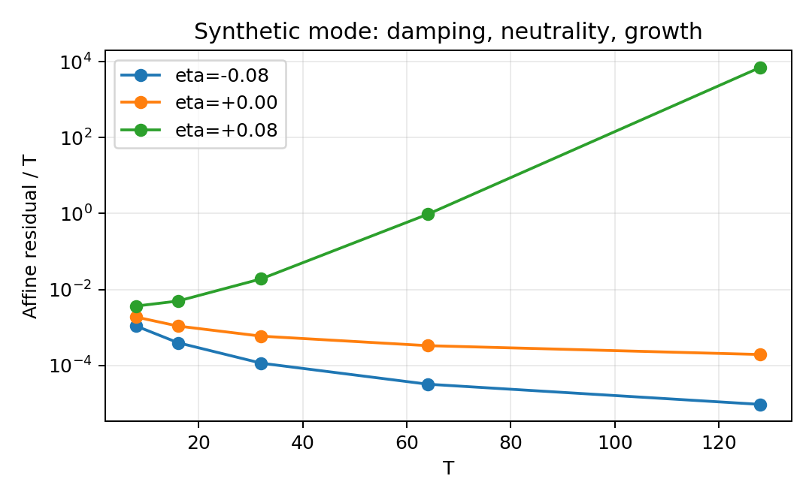

## Introduction

A local affine fit removes more than noise: it can remove a large component of a signal. Consequently, a bound on the residual energy alone does not control the energy of the original signal on a single partition. The question considered here is whether a prescribed family of partitions supplies enough complementary observations to recover that missing control.

The answer is affirmative for a specific logarithmically shrinking mesh. The change in horizon from $T$ to $T+\kappa/2$ is small, but its cumulative effect on mesh placement is of order one in the interior of the observation interval. A knot that is invisible as a boundary of one partition becomes an interior break for the other. The resulting estimate concerns arbitrary locally square-integrable functions and requires neither spectral separation nor a noncancellation assumption on oscillatory sums.

We apply that estimate to the full harmonic field in the SPTB framework [4]. The amplitude residual is the central object. A derivative penalty is unnecessary for the implication from residual boundedness to confinement, provided any larger functional used in its place is well-defined and dominates this residual. This formulation avoids relying on the lower-bound lemmas in the earlier manuscript.

The analytic application has two additional ingredients. First, the zeta zero count controls the total coefficient mass in each unit frequency bin, giving local $L^2$ convergence even at $\alpha=1$. Second, taking a primitive makes the transformed series absolutely summable while retaining every individual pole with positive real part. Polynomial growth is incompatible with such a pole. Conversely, confinement bounds the energy on every translated unit interval and hence gives a linear integrated bound.

Throughout, $\log$ denotes the natural logarithm. Constants in asymptotic notation may depend on fixed parameters, but not on the horizon. All amplitude observations in an asymptotic hypothesis concern the same full function. Numerical truncations below are explicitly separate finite functions.

## Definitions and the confinement criterion

Fix positive constants \(\kappa\) and \(\alpha\ge1\), and \(\sigma\in[1/2,1)\). Let the positive-ordinate nontrivial zeta zeros, counted with multiplicity, be

\[
\rho=\beta+i\gamma,\qquad \gamma>0,
\qquad \eta_\rho=\beta-\sigma,
\qquad a_\rho=|\rho|^{-\alpha}>0.
\]

Use the fixed full field

\[
H_\sigma(t)=\lim_{X\to\infty}
\sum_{0<\gamma\le X}a_\rho e^{\eta_\rho t}\cos(\gamma t)
\quad\text{in }L^2_{\mathrm{loc}}([0,\infty)). \tag{1}
\]

Existence of this limit is justified below by a unit-frequency-bin argument. Summing over both conjugates, as in the earlier SPTB manuscript [4], multiplies this field by two and does not change any conclusion.

For every sufficiently large **real** \(T\), set

\[
h_T=\frac{\kappa}{\log T}.
\]

Partition \([0,T]\) at the multiples of \(h_T\), with the final interval shortened if necessary. Let \(P_T f\) be the independent \(L^2\)-best affine fit on each block; no continuity between fits is imposed. Define the amplitude residual

\[
E_f(T)=\|f-P_Tf\|_{L^2(0,T)}^2. \tag{2}
\]

**Theorem 1 (amplitude confinement criterion).** For the field and exact mesh above, the following are equivalent:

1. Every nontrivial zero satisfies \(\beta\le\sigma\).
2. \(\int_0^T|H_\sigma(t)|^2\,dt=O(T)\).
3. \(E_{H_\sigma}(T)=O(T)\).
4. \(E_{H_\sigma}(T)=O(T^p)\) for some fixed \(p\ge0\).

All bounds concern every sufficiently large real \(T\). The reconstruction and pole arguments below prove the substantive implication (4) to (1); the uniform-window estimate proves (1) to (2), and the remaining forward implications follow from orthogonal projection and inclusion of the linear bound among polynomial bounds.

In particular, if, for some constants \(C,p\ge0\),

\[
E_{H_\sigma}(T)\le C(1+T)^p
\quad\text{for every sufficiently large real }T, \tag{3}
\]

then every nontrivial zeta zero satisfies \(\beta\le\sigma\).

**Corollary 1 (dominating nonnegative functionals).** The confinement implication holds for any well-defined SPTB functional whose amplitude term is (2), whose other terms are nonnegative, and for which

\[
F_\lambda(H_\sigma;T,h_T)\ll T\log T\log\log T
\quad\text{uniformly for all sufficiently large real }T. \tag{4}
\]

Indeed, (4) implies (3), for example with \(p=2\). The derivative penalty is not used in this converse.

**Scope matters.** Both observations below must act on the same field. This proof does not automatically apply if the amplitude itself is replaced by \(H_\sigma^{(X(T))}\), if the hypothesis is known only on a sparse sequence of \(T\)'s, or if \(h_T\) is an arbitrary irregular choice merely comparable to \(1/\log T\). It does apply to the exact canonical mesh above. The earlier SPTB manuscript’s [4] broader admissible mesh regime is covered only if its hypothesis includes this exact mesh, for example through a bound uniform over all admissible mesh choices. A hypothesis for one arbitrary comparable mesh is not established by this proof. Truncating only a nonnegative derivative penalty does not affect the argument.

## Complementary observations and local coercivity

The complementary-output viewpoint is motivated by the elementary FFT butterfly identity

\[
|a+\omega b|^2+|a-\omega b|^2
=2(|a|^2+|b|^2),\qquad |\omega|=1.
\]

One output can vanish while the other retains the signal. For splines, the analogous issue is that a jump in value or slope can hide at a block boundary. A second partition with that boundary inside one of its blocks detects the jump.

This is an analogy between two concrete linear observations. FFT unitarity does not itself prove the estimates that follow.

### Local jump detection

**Lemma 1 (step-hinge coercivity).** On \([0,1]\), consider a piecewise-affine function with one break at \(q\in(0,1)\). After subtracting its left affine part it has the form

\[
g(t)=d\,\mathbf1_{t>q}+e(t-q)_+.
\]

Here \(d\) is the value jump and \(e\) the slope jump. Projecting onto \(\operatorname{span}\{1,t\}\) gives

\[
\inf_{\ell\ \mathrm{affine}}\|g-\ell\|_2^2
=\begin{pmatrix}\bar d&\bar e\end{pmatrix}
M(q)\begin{pmatrix}d\\e\end{pmatrix}, \tag{5}
\]

where, writing \(r=1-q\),

\[
M(q)=
\begin{pmatrix}
qr(1-3qr)&\frac12q^2r^2(2q-1)\\
\frac12q^2r^2(2q-1)&\frac13q^3r^3
\end{pmatrix}.
\]

To verify this, the affine Gram matrix and its inverse are

\[
G=\begin{pmatrix}1&1/2\\1/2&1/3\end{pmatrix},
\qquad G^{-1}=\begin{pmatrix}4&-6\\-6&12\end{pmatrix}.
\]

The moments of the step and hinge are respectively

\[
v_d=\left(r,\frac{1-q^2}{2}\right),
\qquad
v_e=\left(\frac{r^2}{2},\frac13-\frac q2+\frac{q^3}{6}\right).
\]

Subtracting \(v_i^*G^{-1}v_j\) from their raw inner products yields (5). Crucially,

\[
\det M(q)=\frac{q^4(1-q)^4}{12}>0. \tag{6}
\]

For \(q\in[1/8,7/8]\), the trace is less than one, so

\[
\lambda_{\min}(M(q))\ge c_*,
\qquad c_*:=\frac{(7/64)^4}{12}>0. \tag{7}
\]

Scaling to a block of length \(h'\) gives the explicit local bound

\[
\inf_{\ell\ \mathrm{affine}}
\int_{J}|g-\ell|^2
\ge c_*\bigl(h'|d|^2+(h')^3|e|^2\bigr), \tag{8}
\]

provided the break lies between one-eighth and seven-eighths of the way across the block. Thus an interior jump cannot be concealed by one affine fit.

### Placement of the second mesh

Set

\[
T_+=T+\frac\kappa2,\qquad
h=h_T,\qquad h'=h_{T_+}<h,
\qquad J_T=[T/2,3T/4].
\]

At a first-mesh knot \(x_j=jh\in J_T\), its coordinate in the second mesh is

\[
\frac{x_j}{h'}
=j+\theta_j,
\qquad
\theta_j=\frac{x_j}{\kappa}
\log\left(1+\frac{\kappa}{2T}\right). \tag{9}
\]

For \(T\ge\kappa/2\), use \(u/2\le\log(1+u)\le u\) for \(0\le u\le1\). Since \(x_j/T\in[1/2,3/4]\),

\[
\frac18\le\theta_j\le\frac38. \tag{10}
\]

Thus each such knot lies uniformly inside a second-mesh block. For large \(T\), \(h/2\le h'<h\). Since the second blocks are shorter than the spacing of the first knots, different first knots occupy different second blocks. All those crossing blocks are contained in \([0,T]\) for sufficiently large \(T\).

This uses the exact mesh formula and the availability of the bound at both \(T\) and \(T_+\).

## Reconstruction from two residual observations

**Theorem 2 (complementary-mesh reconstruction).** Fix \(\kappa>0\). For every sufficiently large real \(T\) and every \(f\in L^2(0,T+\kappa/2)\), the estimate (14) holds, with a constant depending only on the mesh parameter. If one fixed \(f\in L^2_{\mathrm{loc}}([0,\infty))\) satisfies \(E_f(T)=O(T^p)\) for all sufficiently large real \(T\), where \(p\ge0\), then

\[
\int_0^R |f(t)|^2\,dt=O(1+R^{p+5}).
\]

The implied growth constant may depend on the function on an initial compact interval. The following argument proves the local estimate first, then propagates the remaining affine coefficients.

### Recovering the discarded affine pieces

Let \(P=P_Tf\), and let \(Q=P_{T_+}f\) restricted to \([0,T]\). Write

\[
\mathcal E_T=E_f(T)+E_f(T_+).
\]

The triangle inequality gives

\[
\|P-Q\|_{L^2(0,T)}^2\le2\mathcal E_T. \tag{11}
\]

On a second-mesh block crossing a first-mesh knot, \(P\) has exactly two affine pieces and \(Q\) is affine. Apply (8), then sum over those disjoint crossing blocks. If \(d_j,e_j\) are the value and slope jumps of \(P\) at knots strictly inside \(J_T\), then

\[
\sum_j\bigl(h|d_j|^2+h^3|e_j|^2\bigr)
\le C_1\mathcal E_T, \tag{12}
\]

where \(C_1\) is independent of \(T\) and \(f\). All jump traces here belong to the finite piecewise-affine function \(P\), not to \(f\).

Let \(\ell_T\) be the affine expression of \(P\) on the first first-mesh piece having positive-length intersection with \(J_T\). At almost every point of \(J_T\),

\[
P(t)-\ell_T(t)
=\sum_{x_j\in\operatorname{int}J_T,\ x_j<t}\{d_j+e_j(t-x_j)\}. \tag{13}
\]

There are at most \(C T/h\) such knots. Cauchy-Schwarz, \(|t-x_j|\le T\), and (12) therefore give

\[
\begin{aligned}
\|P-\ell_T\|_{L^2(J_T)}^2
&\le C T\frac{T}{h}
\left(\sum_j|d_j|^2+T^2\sum_j|e_j|^2\right)\\
&\le C\left(\frac{T^2}{h^2}+\frac{T^4}{h^4}\right)\mathcal E_T.
\end{aligned}
\]

Adding \(f-P\) proves the complementary-observation estimate

\[
\boxed{
\inf_{\ell\ \mathrm{affine}}
\|f-\ell\|_{L^2(J_T)}^2
\le C_2(1+T/h_T)^4
\{E_f(T)+E_f(T+\kappa/2)\}.
} \tag{14}
\]

The loss is polynomial. No frequency spacing, spectral sign, or zeta property has entered this estimate. The local comparison leaves an affine ambiguity on \(J_T\), which the overlapping-interval argument below controls up to initial affine data.

### From residual bounds to polynomial full-field growth

Suppose \(f\in L^2_{\mathrm{loc}}([0,\infty))\) satisfies \(E_f(T)=O(T^p)\) for every sufficiently large real \(T\), with fixed \(p\ge0\). Since
\((1+T/h_T)^4\ll T^4(\log T)^4\), (14) yields, for \(r=p+5>3\),

\[
\inf_{\ell\ \mathrm{affine}}
\|f-\ell\|_{L^2(J_T)}^2\ll T^r. \tag{15}
\]

Fix a sufficiently large \(T_0\), put \(T_n=(4/3)^nT_0\), and choose the best affine fit
\(\ell_n(t)=a_n+b_nt\) on \(J_{T_n}\). Consecutive intervals overlap on

\[
J_{T_n}\cap J_{T_{n+1}}
=[2T_n/3,3T_n/4],
\]

an interval of length \(T_n/12\). On this overlap, (15) implies

\[
\|\ell_{n+1}-\ell_n\|_2\ll T_n^{r/2}. \tag{16}
\]

For any affine function \(a+bt\) on a fixed-proportion interval at distance comparable to \(T_n\) from zero, a rescaling \(t=T_nu\) and the positive-definite \(2\times2\) Gram matrix give

\[
|a|\le C T_n^{-1/2}\|a+bt\|_2,
\qquad
|b|\le C T_n^{-3/2}\|a+bt\|_2. \tag{17}
\]

Apply this to (16):

\[
|a_{n+1}-a_n|\ll T_n^{(r-1)/2},
\qquad
|b_{n+1}-b_n|\ll T_n^{(r-3)/2}.
\]

Both exponents are positive. Summing geometric series, including the fixed initial coefficients, gives

\[
|a_n|\ll1+T_n^{(r-1)/2},
\qquad
|b_n|\ll1+T_n^{(r-3)/2}.
\]

It follows that \(\|\ell_n\|_{L^2(J_{T_n})}^2\ll T_n^r\), and hence
\(\|f\|_{L^2(J_{T_n})}^2\ll T_n^r\). The overlapping intervals cover \([T_0/2,\infty)\); summing their geometric bounds and including the initial compact interval proves

\[
\boxed{\int_0^R|f(t)|^2\,dt\ll1+R^r.} \tag{18}
\]

In particular, its primitive \(K(t)=\int_0^t f(u)\,du\) obeys

\[
|K(t)|\le\sqrt{t}\,\|f\|_{L^2(0,t)}
\ll1+t^{(r+1)/2}. \tag{19}
\]

The constant in (18) may depend on the initial compact-interval norm and the initial affine coefficients of \(f\), as well as the residual-bound constants and mesh parameters. Residual observations alone cannot bound an arbitrary initial global affine component.

Thus the uncontrolled affine pieces cannot accumulate into an exponentially growing full field when both complementary observations remain polynomially bounded.

## Local convergence of the full zero field

At \(\alpha=1\), absolute convergence of (1) is not available. Square-summability of coefficients alone is also insufficient for arbitrary clustered frequencies. The following argument supplies the missing local convergence using the zeta zero count per unit interval.

The Riemann-von Mangoldt formula with logarithmic remainder [1, Corollary 1] implies

\[
N(V+1)-N(V)=O(\log(V+2)). \tag{20}
\]

Include both signs of each ordinate when expanding the cosines. Let \(A_k\) be the sum of the absolute coefficients in the frequency bin \([k,k+1)\). Then, with finitely many low bins absorbed into the constant,

\[
A_k\ll \frac{\log(2+|k|)}{(1+|k|)^\alpha},
\qquad \sum_k A_k^2<\infty\quad(\alpha\ge1). \tag{21}
\]

Fix a compact time interval and a real-valued smooth compactly supported function \(\chi\) equal to one on it. The parameters \(\eta_\rho\) lie in a bounded interval. Integration by parts twice therefore gives the uniform bound

\[
\left|\int \chi(t)^2 e^{(\eta_\rho+\eta_{\rho'})t}
e^{i(\gamma-\gamma')t}\,dt\right|
\le C_\chi(1+|\gamma-\gamma'|)^{-2}. \tag{22}
\]

For any finite tail of the series, grouping the squared norm by unit bins gives

\[
\|\chi H_{\mathrm{tail}}\|_2^2
\le C_\chi\sum_{k,l}A_k^{\mathrm{tail}}A_l^{\mathrm{tail}}
(1+|k-l|)^{-2}
\le C_\chi'\sum_k(A_k^{\mathrm{tail}})^2. \tag{23}
\]

The last inequality follows by Cauchy-Schwarz for each difference \(k-l\), then summing the summable kernel. By (21), the right side tends to zero as the lower tail cutoff tends to infinity. Thus the symmetric zero truncations are Cauchy in \(L^2\) on every compact interval, proving (1).

Multiplicity is included in (20). No positive minimum gap between ordinates is assumed.

## Pole preservation and the confinement implication

Set \(z_\rho=\eta_\rho+i\gamma\). Since \(\gamma>0\), \(z_\rho\ne0\). The primitive of each finite truncation is

\[
K_X(t)=\frac12\sum_{0<\gamma\le X}a_\rho
\left\{\frac{e^{z_\rho t}-1}{z_\rho}
+\frac{e^{\bar z_\rho t}-1}{\bar z_\rho}\right\}.
\]

Here

\[
\sum_{\gamma>0}\frac{a_\rho}{|z_\rho|}<\infty \tag{24}
\]

for \(\alpha\ge1\), by the zero-counting estimate. The primitive series consequently converges absolutely and uniformly on compact time intervals. Local \(L^2\) convergence of \(H_X\) identifies its limit with

\[
K(t)=\int_0^t H_\sigma(u)\,du. \tag{25}
\]

For \(\Re w\) sufficiently large, absolute integration of the primitive series yields

\[
\mathcal LK(w)
=\frac1{2w}\sum_{\gamma>0}a_\rho
\left\{\frac1{w-z_\rho}+\frac1{w-\bar z_\rho}\right\}. \tag{26}
\]

For example, termwise integration is justified by bounding each primitive term by a constant times
\((a_\rho/|z_\rho|)(e^{(1-\sigma)t}+1)\) and using (24).

Away from \(w=0\) and the displayed poles, the series in (26) converges locally uniformly: for large \(\gamma\), denominators are comparable to \(\gamma\), uniformly on each compact set, and (24) applies. The poles form a locally finite set because zeta has only finitely many zeros in a bounded region.

Fix an off-line-right zero \(\rho_0\), so \(\Re z_{\rho_0}>0\). At \(w=z_{\rho_0}\), the residue in (26) is

\[
\operatorname{Res}_{w=z_{\rho_0}}\mathcal LK(w)
=\frac1{2z_{\rho_0}}
\sum_{\rho:z_\rho=z_{\rho_0}}a_\rho\ne0. \tag{27}
\]

Other distinct zeros contribute an analytic function in a small neighborhood of this point. Repeated zeros add positive coefficients, so their common residue does not cancel. Notice that no rightmost zero or attained spectral edge was needed.

But (3), Theorem 2, and (25) imply polynomial growth of \(K\). Its Laplace transform is therefore holomorphic on the whole half-plane \(\Re w>0\). Identity with (26) in a far-right half-plane extends throughout the connected right half-plane with its locally finite poles removed. Holomorphy of the actual transform would force the pole in (27) to be removable, contradicting its nonzero residue.

Therefore there is no zero with \(\beta>\sigma\). This proves implication (4) to (1) in Theorem 1.

## The conditional linear bound and completion of Theorem 1

Assume now that every zero satisfies \(\eta_\rho\le0\). Choose a fixed real-valued smooth cutoff \(\chi\) supported in \([-1,2]\), equal to one on \([0,1]\). For an integer \(n\ge0\), write each complex exponential in the cosine expansion at \(t=n+s\) as

\[
a_\rho e^{\eta_\rho n}e^{\pm i\gamma n}
 e^{\eta_\rho s}e^{\pm i\gamma s}.
\]

The translated coefficients have magnitude at most \(a_\rho\). On the fixed support of \(\chi\), the derivatives used in (22) are uniformly bounded, independently of \(n\), because \(\eta_\rho\in[-\sigma,0]\). Applying the same unit-bin estimate (23) gives, first for every finite truncation and then by local \(L^2\) convergence,

\[
\int_n^{n+1}|H_\sigma(t)|^2\,dt
\le C_{\alpha,\sigma}\sum_k A_k^2
\le C'_{\alpha,\sigma}, \tag{28}
\]

uniformly in \(n\). Summing over unit intervals proves

\[
\int_0^T|H_\sigma(t)|^2\,dt\le C(1+T). \tag{29}
\]

Since an orthogonal projection cannot increase its squared residual beyond the original squared norm,

\[
E_{H_\sigma}(T)\le\int_0^T|H_\sigma(t)|^2\,dt=O(T).
\]

This proves the reverse direction and hence all four equivalences in Theorem 1. At \(\sigma=1/2\), the functional equation and conjugation symmetry identify confinement with RH. The criterion is an equivalence; this argument does not independently establish any of its equivalent conditions for the actual zeta field.

## Necessity of the observation assumptions

Consider the continuous piecewise-linear interpolation of \(f(n)=e^{n^2}\) at the nonnegative integers. It is locally square-integrable and grows faster than every polynomial. Yet its affine residual vanishes on every grid of width \(1/m\), because each grid block lies within an interval where \(f\) is affine.

For the exact canonical mesh at sparse horizons \(T_m=e^{\kappa m}\), the width is \(1/m\). Thus \(E_f(T_m)=0\) at every such horizon, although full-field polynomial growth fails. Similarly, the irregular mesh

\[
\widetilde h_T=\frac{1}{\lceil(\log T)/\kappa\rceil}
\sim\frac{\kappa}{\log T}
\]

has zero residual for this \(f\) at every large \(T\). These examples do not refute a zero-specific conjecture. They show why the general reconstruction lemma cannot be extended to arbitrary sparse horizons or arbitrary asymptotically equivalent meshes by assertion alone.

The proof actually needs only the paired horizons \(T_n=(4/3)^nT_0\) and \(T_n+\kappa/2\), with their exact canonical meshes and uniform bounds. The all-real-\(T\) statement is the simpler sufficient hypothesis matching the intended criterion.

## Numerical analysis

### Design and accuracy checks

The computation uses the first 64 positive critical-line zero ordinates returned by `mpmath.zetazero` at 40 decimal digits. The ordinates and numerical values of $|\zeta(\rho)|$ are retained in the supplied CSV. This is not an independently certified zero count. For $N\in\{32,64\}$, we form the fixed finite field

\[
H_{N,\alpha}(t)=\sum_{n=1}^{N}|1/2+i\gamma_n|^{-\alpha}\cos(\gamma_nt),
\qquad \alpha\in\{1,2\}.
\]

For each fixed pair $(N,\alpha)$ the same function is observed at $T=8,16,32,64$, using $\kappa=1$. Define $I_N(T)=\int_0^T|H_{N,\alpha}(t)|^2dt$ and let $E_N(T)$ denote its affine residual. A second experiment varies $\kappa$ at a fixed horizon and cutoff. No moving cutoff is used within a horizon sequence.

Gauss-Legendre quadrature is applied separately on each block, including the shortened final block. In coordinates $t=m+\ell x/2$, $-1\le x\le1$, the affine Gram matrix is diagonal, with entries $2$ and $2/3$ before the Jacobian factor. The projection coefficients are therefore

\[
c_0=\tfrac12\int_{-1}^1 f(m+\ell x/2)\,dx,
\qquad c_1=\tfrac32\int_{-1}^1 x f(m+\ell x/2)\,dx.
\]

The code integrates $(f-c_0-c_1x)^2$ directly. Total finite-field energy is also computed independently from the complex exponential expansion, using $\int_0^T e^{zt}dt=(e^{zT}-1)/z$, with value $T$ at $z=0$.

Quadrature orders 32, 64, and 128 are retained in the raw data. For the critical-line fields, the largest relative residual difference between orders 32 and 128 was $1.106\times10^{-3}$, so the coarsest rule was inadequate in the most oscillatory case. The corresponding difference between orders 64 and 128 was $7.063\times10^{-14}$. For the synthetic modes it was $7.765\times10^{-14}$. The maximum relative discrepancy between order-128 total energy and the independently integrated finite expansion was $6.986\times10^{-14}$. These are floating-point consistency checks, not certified error bounds.

\Needspace{18\baselineskip}

### Finite critical-line fields and cutoff sensitivity

Table 1 gives the final horizon values using order 128. The complete horizon sequences and all quadrature orders are supplied as CSV.

| $N$ | $\alpha$ | $I_N(64)/64$ | $E_N(64)/64$ |
|---:|---:|---:|---:|
| 32 | 1 | 0.0086804624 | 0.0053353887 |
| 32 | 2 | 1.8468565e-05 | 5.5890661e-06 |
| 64 | 1 | 0.0095416852 | 0.0061880721 |
| 64 | 2 | 1.8518251e-05 | 5.636686e-06 |

Table 1: Finite critical-line fields at $T=64$ and $\kappa=1$.

{width=95%}

Increasing $N$ from 32 to 64 changes $E_N(64)/64$ by about 16.0 percent for $\alpha=1$ and 0.85 percent for $\alpha=2$. This is a measured difference between two finite sums, not an estimate of the entire omitted tail. The near-constant full energy density and decreasing normalized residuals are expected for these neutral finite sums.

In fact, each such fixed finite field has bounded second derivative. Taylor approximation at the midpoint of each block gives

\[
E_N(T)\le \frac{\|H_{N,\alpha}''\|_\infty^2}{320}\,T h_T^4.
\]

Indeed, the pointwise Taylor remainder is bounded by $\|H_{N,\alpha}''\|_\infty|t-m|^2/2$, whose squared integral over a block of length $\ell$ is at most $\|H_{N,\alpha}''\|_\infty^2\ell^5/320$. Sum over blocks and use $\ell\le h_T$. The constant depends on $N$; no uniform-in-cutoff estimate follows. This explains why even long runs on a fixed neutral truncation cannot establish the infinite-field premise of Theorem 1.

\Needspace{16\baselineskip}

### Mesh sensitivity and local coercivity

At $T=64$, $N=64$, and $\alpha=1$, the observed mesh dependence is:

| $\kappa$ | $h_T$ | $E_N(T)/T$ |
|---:|---:|---:|
| 0.5 | 0.12022459 | 0.0034560577 |
| 1 | 0.24044917 | 0.0061880721 |
| 2 | 0.48089835 | 0.0087798806 |

Table 2: Mesh sensitivity, using quadrature order 256. The largest relative change from order 128 to 256 was $4.347\times10^{-15}$. These finite values do not imply a general monotonicity law for non-nested partitions.

A scan of 1001 equally spaced points in $q\in[1/8,7/8]$ gave a smallest observed eigenvalue of $M(q)$ equal to $1.616834055\times10^{-4}$, above the conservative analytic bound $c_*=1.192589601\times10^{-5}$. The scan illustrates the estimate; the determinant argument proves positivity on the continuum.

\Needspace{23\baselineskip}

### Synthetic growth test

To test growth independently of the neutral zero table, use

\[
f_\eta(t)=|1/2+i\gamma_1|^{-1}e^{\eta t}\cos(\gamma_1t),
\qquad \eta\in\{-0.08,0,0.08\}.
\]

These are synthetic signals. The altered exponents are not alleged real parts of zeta zeros. Table 3 shows selected normalized residuals; all horizons through $128$ are supplied in the raw data.

| $\eta$ | $T$ | Residual$/T$ |
|---:|---:|---:|
| -0.08 | 16 | 0.00039934319 |
| -0.08 | 64 | 3.236089e-05 |
| -0.08 | 128 | 9.5184414e-06 |
| +0.00 | 16 | 0.0010967475 |
| +0.00 | 64 | 0.00033438501 |
| +0.00 | 128 | 0.00019551874 |
| +0.08 | 16 | 0.005000082 |
| +0.08 | 64 | 0.95952248 |
| +0.08 | 128 | 7073.4397 |

Table 3: Synthetic damping, neutrality, and growth on the same frequency.

{width=78%}

For the growing mode, residual$/T$ rises from approximately $0.96$ at $T=64$ to $7073$ at $T=128$, while the neutral mode decreases over those horizons. This illustrates finite detection despite mesh refinement. It does not establish an exponential lower bound for an infinite superposition, and no growth rate is inferred from a fitted regression.

## Interpretation and remaining questions

The reconstruction theorem gives a precise meaning to complementary boundedness. Two residual observations constrain pieces that either observation alone can discard. The argument first recovers the function modulo an affine component on an interior interval, then uses overlaps to prevent those affine components from drifting faster than a polynomial. This mechanism is a statement about observation operators and their nullspaces. It does not require a physical observer model or a path-integral construction.

For the zero field, the final obstruction is analytic rather than numerical: a positive real exponent contributes a genuine pole to the Laplace transform of the primitive, and positive coefficients prevent coincident poles from cancelling. The argument does not require an attained rightmost zero, uniform spacing between ordinates, or a uniform inverse Gram matrix for all frequencies.

At $\sigma=1/2$, Theorem 1 is an equivalence criterion for RH. Its reverse implication assumes confinement. Using that implication to establish the premise of the forward implication would be circular. The open task is therefore an independent estimate for the actual full-field residual, valid with the required quantifiers. Finite zero tables, finite-horizon fits, and simulations in which every selected zero is placed on the critical line do not provide that estimate.

Three extensions require additional work. First, merely comparable widths do not ensure complementary mesh placement; the general counterexamples above prevent a direct extension of the reconstruction theorem. Second, moving spectral truncations require a quantitative transfer estimate between observations of different functions. Third, a sharp exponential lower bound for the residual at every sufficiently large horizon is stronger than the confinement criterion and is not obtained here. The polynomial loss in Theorem 2 is sufficient for the application and is not asserted to be optimal.

The present manuscript isolates a complete argument for the stated amplitude criterion. It does not import the earlier SPTB manuscript's affine or derivative lower-bound lemmas, and it does not establish a theorem about an ambiguously defined derivative penalty. A separate revision of that functional would be needed before attaching stronger derivative claims to this result.

## Reproducibility and review disclosure

The accompanying source, numerical program, zero-ordinate cache, CSV results, and figures are supplied in the repository alongside this manuscript. The local projection identities are additionally checked by exact rational polynomial arithmetic in `check_complementary_mesh.py`. That program verifies all entries of the step-hinge matrix, its determinant, the exact centered-step residual $1/16$, and nine mesh configurations. These checks passed in the present run. Exact finite algebra and floating-point convergence checks supplement the analytic proof; neither constitutes verification of its infinite-dimensional assertions.

AI assistance was used for drafting, mathematical development, code, and adversarial checks. Three AI agents reviewed the preceding mesh, spectral, and manuscript arguments, and a fourth reviewed the assembled research draft. The present manuscript received a further AI review. These checks are not independent human peer review or formal proof verification. No priority or novelty claim is made; a broader literature comparison remains necessary before submission.

## References

1. T. S. Trudgian. *An improved upper bound for the argument of the Riemann zeta-function on the critical line II*. Journal of Number Theory **134** (2014), 280-292. [arXiv:1208.5846](https://arxiv.org/abs/1208.5846). Corollary 1 supplies an explicit logarithmic zero-counting remainder.

2. NIST Digital Library of Mathematical Functions. [Section 25.10: Zeros](https://dlmf.nist.gov/25.10). Background on the critical strip, conjugation symmetry, and critical-line symmetry; accessed 10 September 2026.

3. NIST Digital Library of Mathematical Functions. [Section 1.14(iii): Laplace Transform](https://dlmf.nist.gov/1.14#iii). Background on Laplace transforms and analytic continuation; accessed 10 September 2026.

4. A. A. Esfahani. *SPTB-RiemannHypothesis*, working manuscript and research repository. [Source manuscript](https://github.com/aakbarie/SPTB-RiemannHypothesis/tree/f8dbb8802cd6dc605e3f06d2286ba5c9a4ae42d7/paper_clean) and [reviewed research argument](https://github.com/aakbarie/SPTB-RiemannHypothesis/tree/b371c1c826a966f619851bacd9593bf26fa7a144/docs/research). The present paper narrows the mesh assumptions explicitly.

5. The mpmath development team. *mpmath: Python library for arbitrary-precision floating-point arithmetic*. [Zeta functions and zero computation documentation](https://mpmath.org/doc/current/functions/zeta.html). Used only for the numerical ordinate calculations, with the installed version recorded in the experiment metadata.
